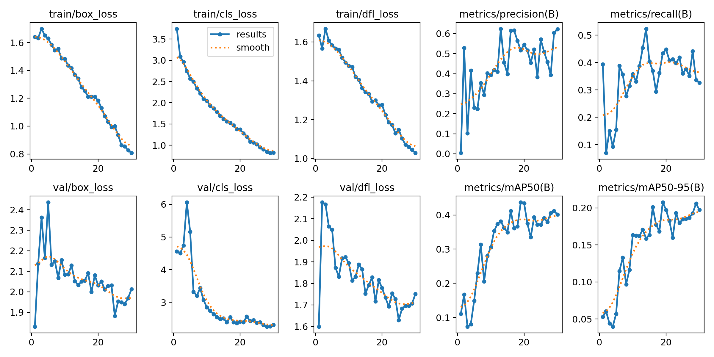
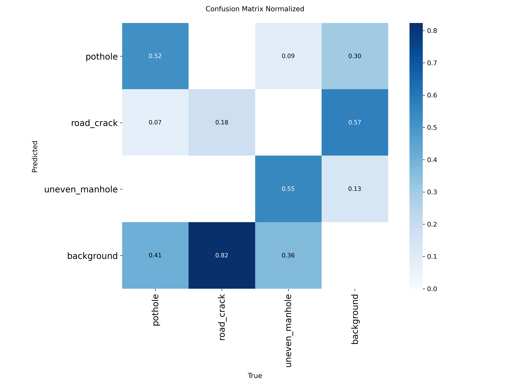

# Road Pavement Defect Detection Using YOLOv8

## Project Overview

This project explores the use of YOLOv8 object detection to identify visible road pavement defects from images.

The model detects three classes:

- pothole
- road_crack
- uneven_manhole

The objective is to support preliminary road-condition screening and identify locations that may require further inspection.

## Quick Start

The project can be run entirely in Google Colab without local installation.

### Training

Open the notebook, select a GPU runtime and run all cells.

### Inference

The inference notebook uses the trained `best.pt` weights and five unseen road images.

## Dataset

The dataset was assembled from selected public datasets and original road photographs, then prepared and versioned in Roboflow.

- Source images: 252
- Classes: 3
- Training images after augmentation: 606
- Validation images: 50
- Dataset version: Version 1
- Image size: 640 × 640

### Project Resources

- **Roboflow Dataset – Version 1:**  
  https://universe.roboflow.com/psprathish-gmail-com/road-pavement-defect-dataset

- **GitHub Release – v1.0:**  
  https://github.com/prathish-lab/M4U3-Road-Pavement-Defect-Detection/releases/tag/v1.0

The GitHub Release contains:

- `road_dataset.zip` – frozen dataset used for reproducible training
- `best.pt` – trained YOLOv8 model weights

Preprocessing included Auto-Orient and resizing. Training augmentation included horizontal flip, brightness adjustment and blur.

## Model Training

- Model: YOLOv8 Nano (`yolov8n.pt`)
- Epochs: 30
- Batch size: 16
- Image size: 640 × 640
- Training environment: Google Colab
- GPU used for reproducibility test: NVIDIA Tesla T4

## Results

| Metric | Result |
|---|---:|
| Precision | 0.511 |
| Recall | 0.434 |
| mAP@50 | 0.438 |
| mAP@50–95 | 0.207 |

The strongest-performing class was `uneven_manhole`, while `road_crack` was the most challenging class.

### Training Curves

### Confusion Matrix

## Detection Evidence

Representative prediction results are available in the [`results`](results/) folder.

The evidence includes:

- 3 successful detection examples
- 3 failure examples
- training curves
- normalized confusion matrix

Detailed failure analysis is available in [`docs/error_analysis.md`](docs/error_analysis.md).

## Limitations

**This model is an assistive tool for preliminary screening only. It produces False Negatives. It must NOT be used as the sole verifier for life-safety decisions.**

Model performance can be affected by lighting, shadows, pavement texture, road markings, viewing distance and visually similar road features.

The model was mainly trained using daytime road images and has not been sufficiently tested under conditions such as night-time, rain, wet pavement, strong glare or poor visibility.

Human verification is required before engineering or maintenance decisions are made.

## Project Documentation

- [Class Definitions](docs/class_definitions.md)
- [Error Analysis](docs/error_analysis.md)
- [Governance Checklist](docs/governance_checklist.md)
- [SAM Exploration](docs/sam_exploration.md)
- [Data Sources and Licensing](docs/data_sources_and_licenses.md)

## License

Project code and notebooks may be used for educational and research purposes.

Dataset images remain subject to their respective source licenses. See [`docs/data_sources_and_licenses.md`](docs/data_sources_and_licenses.md) for details.
